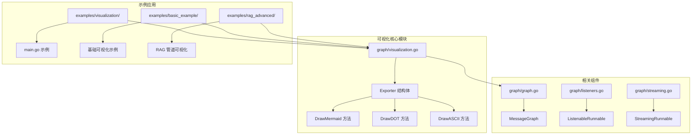
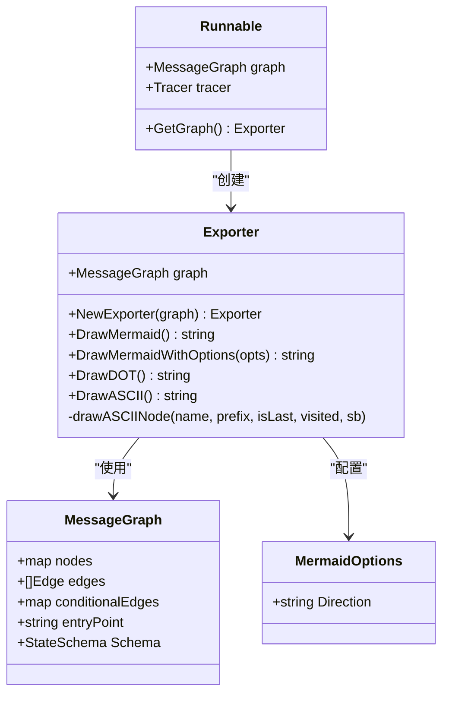
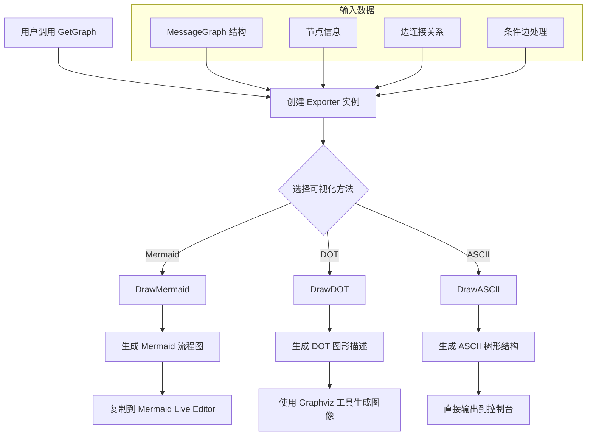
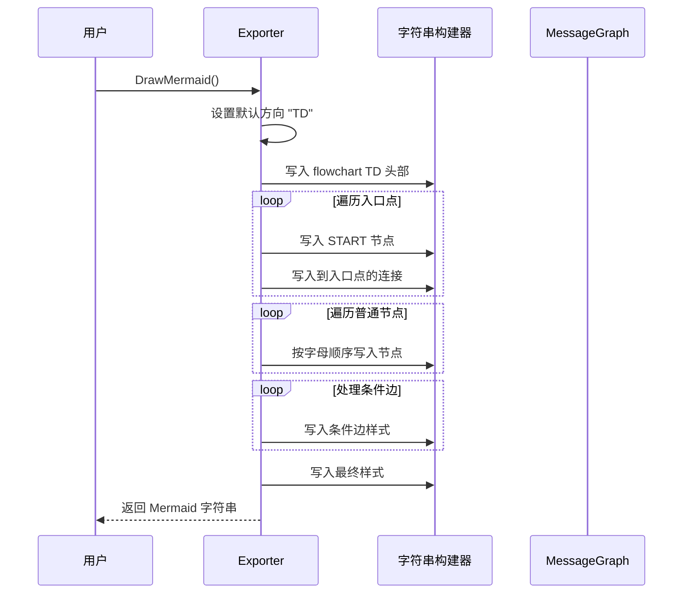
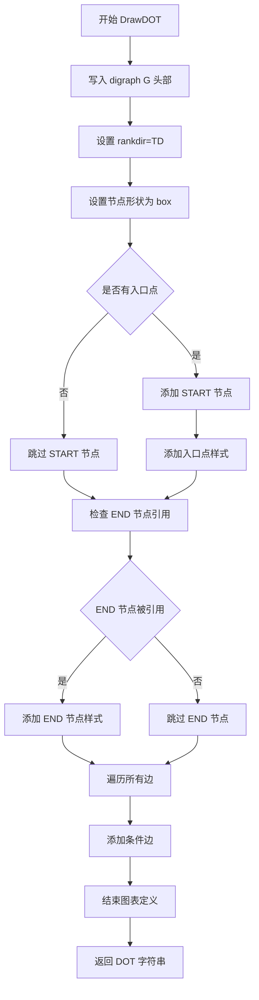
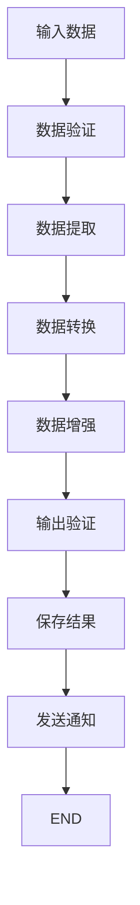
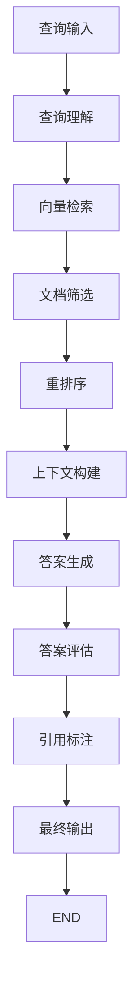
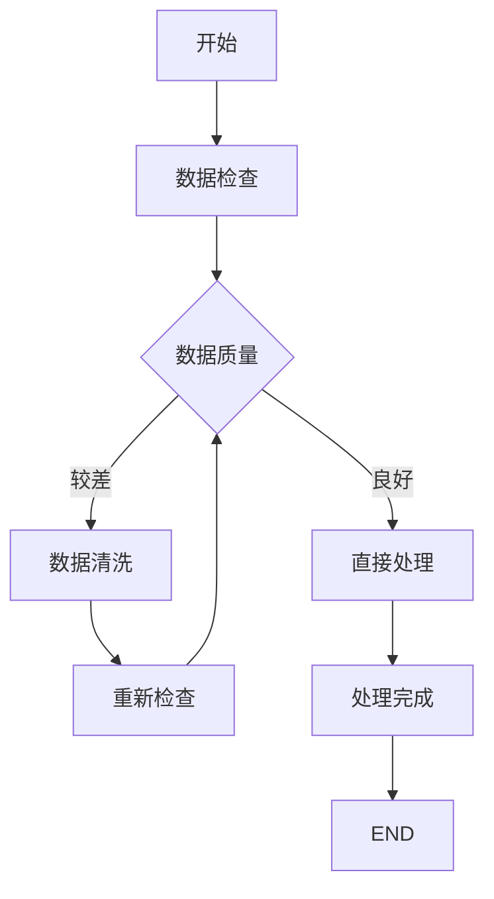
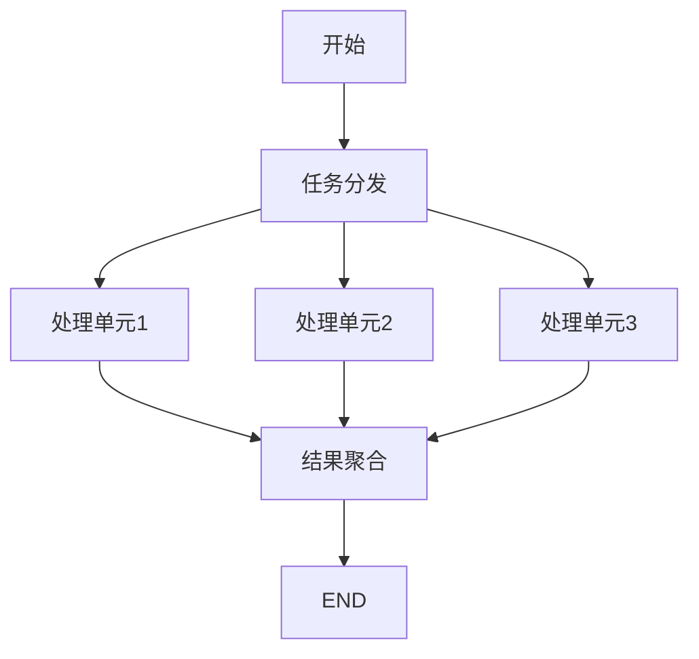

# 可视化

<cite>
**本文档中引用的文件**
- [examples/visualization/main.go](file://examples/visualization/main.go)
- [graph/visualization.go](file://graph/visualization.go)
- [examples/visualization/README.md](file://examples/visualization/README.md)
- [graph/visualization_test.go](file://graph/visualization_test.go)
- [graph/graph.go](file://graph/graph.go)
- [examples/basic_example/main.go](file://examples/basic_example/main.go)
- [examples/rag_advanced/main.go](file://examples/rag_advanced/main.go)
- [graph/listeners.go](file://graph/listeners.go)
</cite>

## 目录
1. [简介](#简介)
2. [项目结构](#项目结构)
3. [核心组件](#核心组件)
4. [架构概览](#架构概览)
5. [详细组件分析](#详细组件分析)
6. [可视化方法详解](#可视化方法详解)
7. [实际应用场景](#实际应用场景)
8. [性能考虑](#性能考虑)
9. [故障排除指南](#故障排除指南)
10. [结论](#结论)

## 简介

LangGraphGo 提供了一套强大的图结构可视化能力，通过 Exporter 组件支持多种格式的流程图生成。该可视化系统能够帮助开发者直观地理解和调试复杂的工作流结构，支持 Mermaid、Graphviz DOT 和 ASCII 三种主要的可视化格式。

可视化功能的核心价值在于：
- **调试辅助**：快速定位工作流中的逻辑问题
- **文档生成**：自动生成工作流的图形化文档
- **团队协作**：便于团队成员理解复杂的业务流程
- **设计验证**：在开发阶段验证工作流设计的正确性

## 项目结构

LangGraphGo 的可视化功能主要分布在以下模块中：



**图表来源**
- [graph/visualization.go](file://graph/visualization.go#L1-L226)
- [examples/visualization/main.go](file://examples/visualization/main.go#L1-L97)
- [graph/graph.go](file://graph/graph.go#L1-L200)

**章节来源**
- [examples/visualization/README.md](file://examples/visualization/README.md#L1-L25)
- [graph/visualization.go](file://graph/visualization.go#L1-L226)

## 核心组件

### Exporter 结构体

Exporter 是可视化功能的核心组件，负责将图结构转换为各种可视化格式：



**图表来源**
- [graph/visualization.go](file://graph/visualization.go#L9-L25)
- [graph/graph.go](file://graph/graph.go#L74-L93)
- [graph/graph.go](file://graph/graph.go#L140-L146)

### 可视化方法类型

| 方法名称 | 输出格式 | 主要用途 | 特点 |
|---------|---------|---------|------|
| DrawMermaid | Mermaid 图表语言 | 文档展示、在线预览 | 支持交互式图表，易于嵌入文档 |
| DrawDOT | Graphviz DOT 语言 | 图像生成、复杂布局 | 强大的布局算法，适合复杂图形 |
| DrawASCII | ASCII 树形结构 | 日志输出、快速查看 | 简单易读，适合命令行环境 |

**章节来源**
- [graph/visualization.go](file://graph/visualization.go#L25-L225)

## 架构概览

LangGraphGo 的可视化架构采用分层设计，从底层的图结构到上层的可视化输出：



**图表来源**
- [graph/visualization.go](file://graph/visualization.go#L25-L225)
- [examples/visualization/main.go](file://examples/visualization/main.go#L65-L85)

## 详细组件分析

### Mermaid 可视化方法

Mermaid 可视化提供了最丰富的图形表示能力，支持多种样式和交互特性：

#### DrawMermaid 方法



**图表来源**
- [graph/visualization.go](file://graph/visualization.go#L26-L95)

#### DrawMermaidWithOptions 方法

该方法允许自定义 Mermaid 图表的方向和其他选项：

```mermaid
flowchart LR
A[MermaidOptions] --> B{检查 Direction}
B --> |为空| C[设置默认 "TD"]
B --> |有值| D[使用指定方向]
C --> E[生成 flowchart TD]
D --> F[生成 flowchart LR]
E --> G[返回 Mermaid 字符串]
F --> G
```

**图表来源**
- [graph/visualization.go](file://graph/visualization.go#L32-L95)

### DOT 可视化方法

DOT 格式是 Graphviz 工具的标准输入格式，适合生成高质量的图形图像：

#### DrawDOT 方法实现



**图表来源**
- [graph/visualization.go](file://graph/visualization.go#L98-L142)

### ASCII 可视化方法

ASCII 可视化提供了最简单的文本表示方式，适合快速查看和日志记录：

#### DrawASCII 方法实现

ASCII 可视化采用递归树形结构的方式展示图的执行流程：

```mermaid
flowchart TD
A[开始 DrawASCII] --> B{检查入口点}
B --> |无入口点| C[返回 "No entry point set"]
B --> |有入口点| D[初始化访问标记]
D --> E[写入 "Graph Execution Flow:"]
E --> F[写入 "├── START"]
F --> G[调用 drawASCIINode]
G --> H[标记当前节点为已访问]
H --> I[查找出口边]
I --> J{是否有条件边}
J --> |是| K[添加 "(Conditional)" 到出口列表]
J --> |否| L[保持出口列表不变]
K --> M[对出口列表排序]
L --> M
M --> N[递归绘制子节点]
N --> O{是否到达 END}
O --> |是| P[停止递归]
O --> |否| Q[继续绘制]
P --> R[返回完整 ASCII 树]
Q --> R
```

**图表来源**
- [graph/visualization.go](file://graph/visualization.go#L145-L220)

**章节来源**
- [graph/visualization.go](file://graph/visualization.go#L25-L225)

## 可视化方法详解

### Mermaid 格式可视化

Mermaid 格式是最适合文档展示和在线预览的可视化方案：

#### 特点与优势
- **交互性强**：支持鼠标悬停、点击等交互操作
- **样式丰富**：内置多种颜色和形状选项
- **易于集成**：可以直接嵌入 Markdown 文档
- **实时预览**：配合 Mermaid Live Editor 可以实时查看效果

#### 使用场景
- **技术文档**：在 README 文件中展示工作流结构
- **API 文档**：说明 API 调用的流程和状态转换
- **培训材料**：制作教学用的工作流图解
- **设计评审**：在团队会议中展示工作流设计

#### 示例输出结构
```
flowchart TD
    START(["START"])
    START --> validate_input
    validate_input --> fetch_data
    fetch_data --> transform
    transform -.-> transform_condition((?))
    transform_condition --> enrich
    enrich --> validate_output
    validate_output --> save
    save --> notify
    notify --> END(["END"])
    style validate_input fill:#87CEEB
    style START fill:#90EE90
    style END fill:#FFB6C1
    style transform_condition fill:#FFFFE0,stroke:#333,stroke-dasharray: 5 5
```

### DOT 格式可视化

DOT 格式适合需要生成高质量图像的应用场景：

#### 特点与优势
- **布局智能**：Graphviz 提供强大的自动布局算法
- **图像质量高**：可以生成矢量图形和位图图像
- **定制性强**：支持丰富的样式和布局选项
- **工具链完整**：有成熟的工具链支持

#### 使用场景
- **报告生成**：在正式报告中插入高质量的流程图
- **系统设计**：在系统架构文档中展示复杂的工作流
- **自动化脚本**：通过脚本批量生成工作流图像
- **打印输出**：需要高质量图像的印刷材料

#### 示例输出结构
```
digraph G {
    rankdir=TD;
    node [shape=box];
    START [label="START", shape=ellipse, style=filled, fillcolor=lightgreen];
    START -> validate_input;
    validate_input [style=filled, fillcolor=lightblue];
    END [label="END", shape=ellipse, style=filled, fillcolor=lightpink];
    validate_input -> fetch_data;
    fetch_data -> transform;
    transform -> transform_condition [style=dashed, label="?"];
    transform_condition [label="?", shape=diamond, style=filled, fillcolor=lightyellow];
    transform_condition -> enrich;
    enrich -> validate_output;
    validate_output -> save;
    save -> notify;
    notify -> END;
}
```

### ASCII 格式可视化

ASCII 格式最适合命令行环境和日志输出：

#### 特点与优势
- **简单易读**：纯文本格式，无需特殊工具
- **兼容性好**：几乎所有终端都支持
- **轻量级**：不依赖额外的渲染工具
- **便于版本控制**：可以清晰地显示变更历史

#### 使用场景
- **调试输出**：在开发过程中快速查看工作流结构
- **日志记录**：在日志中包含工作流的状态信息
- **命令行工具**：在 CLI 应用中显示工作流进度
- **容器化部署**：在 Docker 容器中显示工作流状态

#### 示例输出结构
```
Graph Execution Flow:
├── START
├── validate_input
│   ├── fetch_data
│   │   ├── transform
│   │   │   ├── (?)
│   │   │   └── enrich
│   │   ├── validate_output
│   │   │   ├── save
│   │   │   │   ├── notify
│   │   │   │   └── END
│   │   │   └── (cycle)
│   └── (cycle)
```

**章节来源**
- [examples/visualization/main.go](file://examples/visualization/main.go#L68-L85)
- [graph/visualization.go](file://graph/visualization.go#L26-L142)

## 实际应用场景

### 基础工作流可视化

在简单的数据处理管道中，可视化功能可以帮助理解数据流转过程：



**图表来源**
- [examples/visualization/main.go](file://examples/visualization/main.go#L14-L57)

### 复杂 RAG 系统可视化

在 RAG（检索增强生成）系统中，可视化功能展示了复杂的多步骤处理流程：



**图表来源**
- [examples/rag_advanced/main.go](file://examples/rag_advanced/main.go#L145-L156)

### 条件分支工作流

对于包含条件判断的工作流，可视化功能特别有用：



**图表来源**
- [examples/visualization/main.go](file://examples/visualization/main.go#L48-L52)

### 并行处理工作流

在支持并行执行的工作流中，可视化功能展示了并发处理的能力：



**章节来源**
- [examples/visualization/main.go](file://examples/visualization/main.go#L1-L97)
- [examples/rag_advanced/main.go](file://examples/rag_advanced/main.go#L145-L156)

## 性能考虑

### 渲染性能优化

可视化方法的性能主要取决于图的规模和复杂度：

| 可视化类型 | 性能特点 | 适用场景 | 优化建议 |
|-----------|---------|---------|---------|
| ASCII | 最快，O(n) 时间复杂度 | 大型图，频繁调用 | 适合生产环境的日志输出 |
| Mermaid | 中等，O(n log n) 时间复杂度 | 中等规模图，文档展示 | 合理控制节点数量 |
| DOT | 较慢，O(n²) 时间复杂度 | 小到中等规模图，图像生成 | 避免过于复杂的布局 |

### 内存使用优化

- **字符串构建器**：使用 `strings.Builder` 减少内存分配
- **递归深度**：ASCII 可视化采用递归，注意避免过深的调用栈
- **缓存机制**：对于重复的可视化请求，考虑添加缓存

### 扩展性考虑

- **大规模图**：对于超过 100 个节点的图，建议使用 DOT 格式
- **实时可视化**：在需要实时更新的场景中，优先考虑 ASCII 格式
- **批量处理**：对于批量生成的需求，可以并行处理多个 Exporter 实例

## 故障排除指南

### 常见问题及解决方案

#### 1. 入口点未设置错误

**问题描述**：尝试可视化时出现 "entry point not set" 错误

**解决方案**：
```go
// 确保设置了入口点
g.SetEntryPoint("main_node")
exporter := runnable.GetGraph()
```

#### 2. 条件边显示异常

**问题描述**：条件边没有正确显示或样式不正确

**解决方案**：
- 检查条件边的注册是否正确
- 确认条件函数返回有效的节点名称
- 验证条件边的处理逻辑

#### 3. ASCII 可视化循环检测

**问题描述**：在循环工作流中，ASCII 可视化可能无法正确识别循环

**解决方案**：
- ASCII 可视化会自动检测循环并在节点名后添加 "(cycle)"
- 如果需要更精确的循环检测，可以考虑使用 Mermaid 或 DOT 格式

#### 4. DOT 图像生成问题

**问题描述**：生成的 DOT 文件无法正确渲染为图像

**解决方案**：
- 确保安装了 Graphviz 工具
- 检查 DOT 语法是否正确
- 验证文件扩展名为 `.dot`

### 调试技巧

#### 1. 分步调试可视化

```go
// 分别测试不同的可视化方法
fmt.Println("Mermaid:")
fmt.Println(exporter.DrawMermaid())

fmt.Println("DOT:")
fmt.Println(exporter.DrawDOT())

fmt.Println("ASCII:")
fmt.Println(exporter.DrawASCII())
```

#### 2. 验证图结构完整性

```go
// 检查图的基本属性
fmt.Printf("节点数量: %d\n", len(exporter.graph.nodes))
fmt.Printf("边数量: %d\n", len(exporter.graph.edges))
fmt.Printf("条件边数量: %d\n", len(exporter.graph.conditionalEdges))
fmt.Printf("入口点: %s\n", exporter.graph.entryPoint)
```

**章节来源**
- [graph/visualization_test.go](file://graph/visualization_test.go#L10-L50)

## 结论

LangGraphGo 的可视化功能为开发者提供了一套完整的图结构展示解决方案。通过 Exporter 组件提供的三种可视化方法，开发者可以根据具体需求选择最适合的展示方式：

### 主要优势

1. **多样化格式支持**：Mermaid、DOT、ASCII 三种格式满足不同场景需求
2. **易于集成**：与现有的 LangGraphGo 工作流无缝集成
3. **灵活配置**：支持自定义选项和样式
4. **性能优化**：针对不同规模的图进行了性能优化

### 最佳实践建议

1. **开发阶段**：使用 ASCII 格式进行快速调试
2. **设计阶段**：使用 Mermaid 格式创建交互式文档
3. **发布阶段**：使用 DOT 格式生成高质量的图像
4. **维护阶段**：结合多种格式进行全面的可视化监控

### 未来发展方向

- **交互式可视化**：增强 Mermaid 格式的交互能力
- **动态更新**：支持运行时动态更新可视化内容
- **主题定制**：提供更多预设的主题和样式选项
- **导出格式扩展**：支持更多专业的图表格式

通过合理运用这些可视化功能，开发者可以显著提高工作流的设计效率和维护质量，为构建复杂的多步骤处理系统提供强有力的支持。